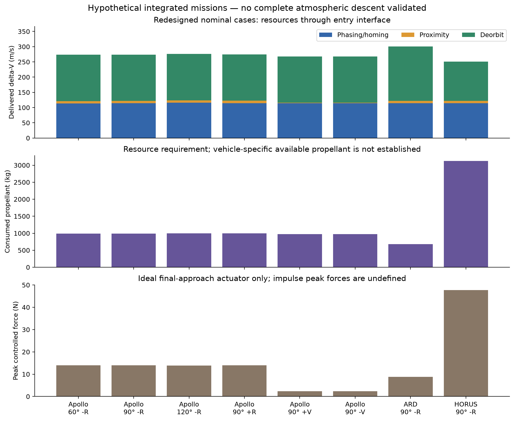
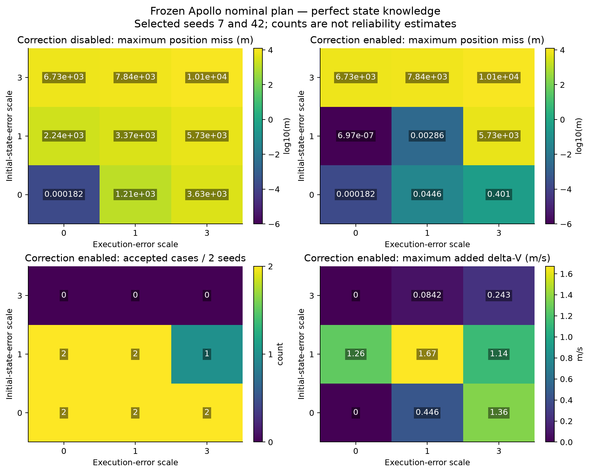
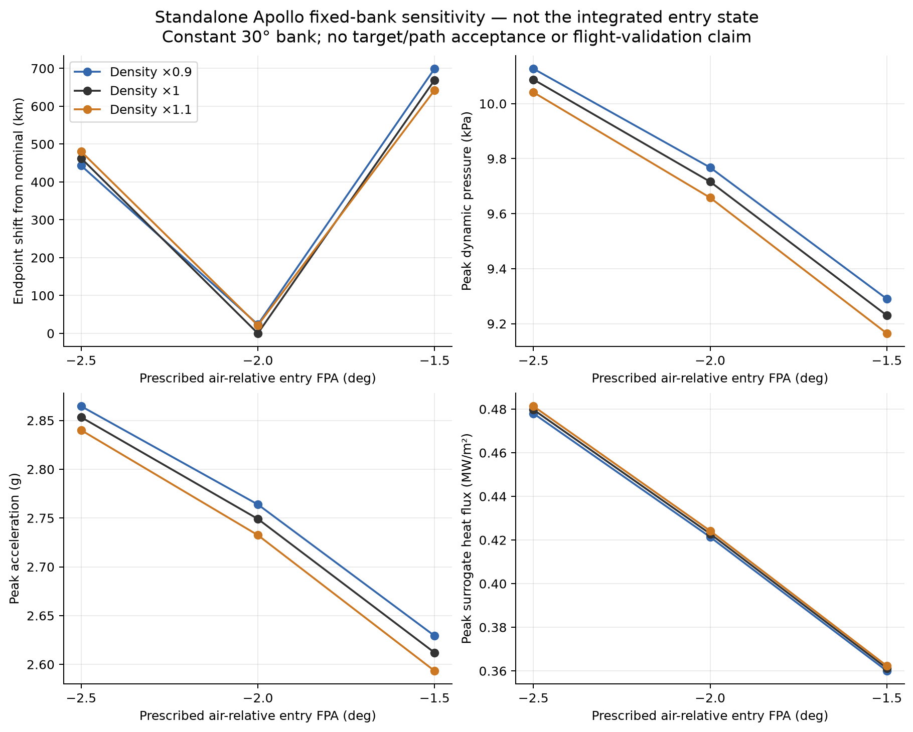

# 성능 평가 및 검증 보고서

## 평가 정의

Design sweep은 구성마다 nominal mission을 다시 설계한다. Robustness trial은 nominal design을 고정하고 구현된 online correction만 허용한다. Standalone entry sensitivity와 final-approach component 시험은 integrated mission trial과 구별한다. 아래 수치는 저장된 evidence의 결과이며 서로 다른 mass·정책·종료점의 값을 하나의 순위로 합치지 않는다.

현재 입증 범위는 nominal orbital handoff와 proximity, 범위 안 standalone entry의 수치 일관성, selected data/equation regression이다. 실제 nominal integrated entry는 reference Mach domain을 초과한다. Flight trajectory reproduction, navigation robustness, landing reliability 및 global optimality는 입증하지 않는다.

## Nominal planner 비교

ARD stack 4800 kg, 300→500 km, J2 on, drag off, Isp 200 s, 동일 `[0,−5000,0] m`/zero-velocity handoff 조건이다. Grid horizon은 analytical wait의 1.1배로 제한한다. Runtime은 해당 실행 환경의 측정값이며 일반 성능 보장이 아니다.

| 초기 phase / 방법 | Planning+Phase 1 s | Position miss m | Phase 1 ΔV m/s | Phase 2 handoff ΔV m/s | Phase 2 전체 ΔV m/s | Phase 2까지 합계 m/s |
|---|---:|---:|---:|---:|---:|---:|
| 90° nominal | 1.457 | .000181 | 114.072760 | <1e−12 | 7.477427 | 121.550187 |
| 90° bounded grid | 6.289 | 17555.4 | 123.592857 | 미실행 | 미실행 | — |
| 90° historical replay | 1.351 | .134334 | 57.992997 | 57.419455 | 64.891782 | 122.884779 |
| 60° nominal | 1.125 | .001299 | 113.256818 | <1e−12 | 7.473014 | 120.729832 |
| 60° bounded grid | 6.294 | 15745.3 | 120.071615 | 미실행 | 미실행 | — |
| 60° historical replay | 2.025 | 3136.42 | 57.992997 | 미실행 | 미실행 | — |

Nominal velocity residual은 두 case에서 1e−12 m/s 미만이다. Integration refinement에 따른 position 차이는 약 .01713 m로 root-solver residual보다 크다. Fresh Python optimization 두 시도는 각각 외부 90 s 제한까지 candidate를 반환하지 못했다. 완료한 optimizer 대비 동등 품질 speedup 또는 optimized cost를 보고할 수 없다. Historical replay runtime은 과거 최적화 시간을 포함하지 않으며, 원래 optimizer는 iteration-limit 상태였다.

원본: [nominal benchmark](nominal_stage_2026-09-21/benchmark.json). 결과는 이 제한된 candidate의 성패이며 다른 wait/architecture의 물리적 불가능성을 판정하지 않는다.

## Integrated design sweep

8 configurations 모두 orbital/proximity/deorbit state를 생성하지만 atmospheric entry 시작 조건이 aero domain을 넘는다. 아래 propellant는 entry 전 maneuver 비용이다. Proximity force는 ideal actuator 결과다.

| Vehicle / phase / approach | Phase 1 ΔV m/s | Phase 2 ΔV m/s | Deorbit ΔV m/s | Propellant kg | Peak force N | EI Mach |
|---|---:|---:|---:|---:|---:|---:|
| Apollo / 60° / −R | 113.257 | 7.473 | 152.906 | 990.751 | 13.984 | 28.793 |
| Apollo / 90° / −R | 114.073 | 7.477 | 152.277 | 991.395 | 13.938 | 28.795 |
| Apollo / 120° / −R | 115.806 | 7.485 | 152.675 | 998.609 | 13.891 | 28.828 |
| Apollo / 90° / +R | 114.073 | 8.417 | 152.386 | 994.933 | 13.929 | 28.795 |
| Apollo / 90° / +V | 114.073 | 1.949 | 151.959 | 971.640 | 2.341 | 28.838 |
| Apollo / 90° / −V | 114.073 | 1.829 | 151.959 | 971.234 | 2.341 | 28.838 |
| ARD / 90° / −R | 114.073 | 7.477 | 178.925 | 681.800 | 8.793 | 28.724 |
| HORUS / 90° / −R | 114.073 | 7.477 | 129.365 | 3125.721 | 47.683 | 28.869 |

Apollo ±V는 동일 S2와 500/250/30 m requirement에서 −R보다 Phase 2 비용이 작지만 total duration은 약 909 s 길다. Apollo −R의 EI까지 시간은 phase 60/90/120°에서 약 34745/45199/55662 s다. 120° case는 correction의 40000 s guard를 적용한 성공 사례가 아니다. Vehicle 간 mass, EI FPA 및 endpoint 조건이 다르므로 propellant로 vehicle 우열을 평가하지 않는다.

모든 design case에서 controlled tracking 최대 오차는 .00666–.01148 m이며 force saturation은 없다. 이는 ideal force와 perfect state knowledge 조건이다.

## Fixed-design orbital robustness

Apollo 90° nominal plan을 동결한다. Initial-state error scale 0/1/3, maneuver error scale 0/1/3, seed 7/42의 18 case를 correction off/on으로 각각 전파한 총 36 runs다. Scale 1은 σr=20 m/axis, σv=.02 m/s/axis, gain σ=.002, pointing-vector σ=.0002 rad다. 오류 분포는 탐색 가정이며 실제 센서·추진기 분포가 아니다. State는 완전하게 알려진 것으로 가정한다.

Phase 1 propellant allowance는 `400 × 7608.261421917 / 4800 = 634.0218 kg`다. 이는 reference stack mass 변경에 따른 실험 allowance이며 탱크 사양이 아니다. 기본 400 kg은 zero-error Apollo case도 arrival burn 전에 거부한다. 그때 이미 사용한 양은 222.293 kg, 전체 요구량은 약 429.881 kg이다.

| Initial error scale | Burn scale 0 | Burn scale 1 | Burn scale 3 |
|---|---:|---:|---:|
| 0 | 2/2 | 2/2 | 2/2 |
| 1 | 2/2 | 2/2 | 1/2 |
| 3 | 0/2 | 0/2 | 0/2 |

표는 correction enabled의 handoff acceptance 수다. Enabled는 전체 11/18, disturbed case만 9/16이며 disabled는 zero-error 두 case만 통과한다. 실패 7건은 예측 correction이 capability limit를 초과한 경우로 실제 position miss는 약 5.52–10.12 km다. 이 표본에서 numerical nonconvergence와 같은 의미로 분류하지 않는다.

Enabled propellant는 실패 case를 포함해 418.881–436.826 kg다. 실패로 조기 종료한 낮은 연료값을 효율 향상으로 해석하지 않는다. 선정한 두 seed의 case count에 불과하므로 confidence interval이나 mission reliability를 제시하지 않는다. 추가 phasing leg의 필요성은 현재 bounded policy에서 실패했다는 사실만으로 확정되지 않는다.

## Final approach와 entry sensitivity

### Proximity component

동일 final-approach policy에 H 방향 초기 offset 0/1/5 m와 velocity offset 0/.02 m/s를 조합한 6 case는 모두 6120 s에 종료한다. Closing을 다시 설계하지 않고 actual disturbed truth를 사용한다. ΔV는 6.13945–6.16215 m/s, propellant 22.4197–22.5024 kg, peak force 13.94–23.98 N이다. Saturation과 검사한 constraint violation은 없다. 최대 tracking error 5.077 m에는 주어진 초기 offset도 포함된다. 이는 upstream disturbed mission 전체의 연속 검증이 아니다.

### Standalone Apollo entry

공통 initial state는 geocentric lat/lon 25°/40°, altitude 121920 m, air-relative speed 7400 m/s, heading 70°다. Initial/commanded bank는 30°, endpoint는 7620 m이며 maximum time 1800 s, MaxStep 2 s, RelTol 1e−9다. FPA −2.5/−2/−1.5°와 density scale .9/1/1.1의 9 case, nominal FPA/density에서 L/D scale .9/1.1의 2 case를 사용한다.

| 지표 | Nominal FPA −2°, density=1 | 전체 11 case 범위 |
|---|---:|---:|
| Endpoint time | 729.1147 s | 660.1–825.0 s |
| Peak dynamic pressure | 9.716351 kPa | 8.936–10.361 kPa |
| Peak aerodynamic load | 2.749067 g | 2.559–2.899 g |
| Peak Sutton–Graves heat flux | .422885 MW/m² | .3600–.4813 MW/m² |

Nominal Mach는 약 27.1252→.45768로 table 안에 있다. 모든 case의 endpoint 도달은 finite path limit나 recovery target acceptance가 아니다. Nominal endpoint와의 ECEF chord 차이는 FPA −2.5/−1.5°에서 462.8/669.4 km, density .9/1.1에서 23.57/21.25 km, L/D .9/1.1에서 157.54/166.91 km다. 이 수치는 지정 landing target의 miss distance나 downrange-only 오차가 아니다.

MaxStep 1 s, RelTol 1e−10 refinement의 endpoint 차이는 .0173883 m, event-time 차이는 약 6.35e−7 s다. 이는 numerical convergence이며 flight prediction accuracy가 아니다.

## Public benchmark와 validation coverage

| 검증 계층 | 확인 가능한 내용 | 확인하지 않는 내용 |
|---|---|---|
| Source regression | Apollo 단위/trim, HORUS table/missing cells, ARD 변환·profile anchors | 모든 자동 check가 원문 전 cell의 독립 증명이라는 주장 |
| Coordinate/interface | ECI–LVLH, rotating velocity, entry convention, state/mass/time 전달 | 정밀 지구 orientation·실제 navigation |
| Dynamics equivalence | Frozen equations 대비 shared kernel 회귀, event/refinement | 물리 가정의 flight validity |
| Planning/control | Nominal tolerances, correction ledger, paired RNG, 4 approach modes, failure detection | Arbitrary orbit/uncertainty에서의 성공 보장 |
| Public HTV geometry | 500/250/30 m, nominal 8.839658 m/min이 공개 1–10 m/min 범위 | ISS plane·RVS·10 m capture·flight software 재현 |
| Apollo/ARD/HORUS 자료 | 해당 mass/aero/geometry/profile의 source 추적 | 가상 integrated mission의 실제 비행 이력 재현 |
| Zhang/Saito adapter | 공개 table·식·case grid·좌표 roundtrip | Optimal trajectory, landing dispersion, thermal flight 결과 |

현재 기본 Main의 orbital dashboard 실행, 사용 설명서의 correction example, 전체 MATLAB suite와 활성 154개 MATLAB 파일의 Code Analyzer 결과는 [interface verification](interface_verification/summary.json)에 기록되어 있다. Default Main의 최종 position error는 약 .000587068 m다. Python I/O/compatibility 검사는 별도 unittest이며 MATLAB-only nominal에 Python optimizer가 필수라는 뜻은 아니다.

## 종료 상태와 실패 분류

| 분류 | 해석 |
|---|---|
| Accepted handoff / standoff | 해당 position/velocity/resource 검사 통과 |
| `WORK_LIMIT`, `ITERATION_LIMIT`, `SINGULAR_JACOBIAN`, `NO_DESCENT` | Numerical procedure가 acceptance를 확립하지 못함 |
| `DEMONSTRATED_CONSTRAINT_VIOLATION` / resource limit | 평가한 candidate에서 명시한 bound 위반 |
| `reference_vehicle:Domain`, `TrimOnly` | Reference model의 적용 범위 밖 |
| `UNRESOLVED_BY_SEARCH` | Bounded target search가 witness를 찾지 못함 |
| `REACHABLE_WITNESS` | 실제 계산 궤적 하나가 지정 terminal/path 조건을 만족 |

Optimization success flag, target residual, path status, model validity는 별도 항목이다. 어떤 하나의 실패나 성공으로 나머지를 대체하지 않는다.

## 재현 자료

| 자료 | 내용 |
|---|---|
| [Evaluation results](evaluation_stage_2026-09-22/results.json) | 구성별 정량 결과, 실패 분류 |
| [Evaluation driver](evaluation_stage_2026-09-22/evaluate_simulator.m) / [finalizer](evaluation_stage_2026-09-22/finalize_evaluation.m) | 고정 설계·disturbance·entry case 생성 및 집계 |
| [Source manifest](evaluation_stage_2026-09-22/source_manifest.json) | 평가 대상 코드 hash; 현재 checkout과 자동 동일하지 않음 |
| [Plot script](evaluation_stage_2026-09-22/plot_results.py) | 저장된 CSV/JSON에서 PNG/PDF 생성 |
| [Nominal evidence](nominal_stage_2026-09-21/) / [correction evidence](correction_stage_2026-09-21/) / [approach evidence](approach_stage_2026-09-21/) | 알고리즘별 benchmark 및 회귀 결과 |
| [Apollo](apollo7_stage_2026-09-21/) / [profiles](profile_stage_2026-09-21/) / [HORUS profile](horus_speed_stage_2026-09-21/) | Source hashes, transcription/profile 검사 |
| [Interface evidence](interface_verification/) | Main 실행·suite·dashboard 결과 |
| [Audit baseline](audit_baseline_2026-09-21/) / [reference interface evidence](migration_stage_2026-09-21/) / [guidance research](entry_guidance_stage_2026-09-21/) | 이전 설정·자료 조사·계약 검사 원본 |

기본 evaluation 기록의 runtime은 약 137.9 s다. MAT 파일에는 개별 case와 frozen nominal을 보존한다. 날짜가 포함된 경로는 변경하지 않는 evidence ID다. 새로운 실행의 결과와 원본을 구별하려면 기존 evidence를 덮어쓰기 전에 별도의 output 위치/복사본을 사용한다.
