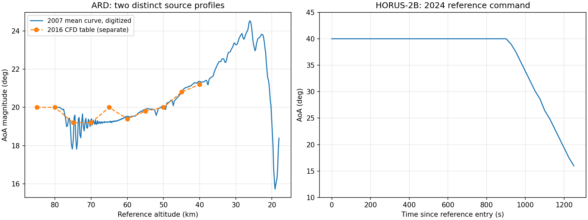

# Reference AoA profiles — 2026-09-21 follow-up

## Current HORUS selection: user-supplied speed schedule

The user's subsequent selection supersedes the HORUS **default** described in
the historical extraction record below. HORUS now uses the supplied
Shuttle-inspired graph, interpreted using **atmosphere-relative speed**:

- V ≤2000 m/s: alpha15°.
- 2000 < V <5000 m/s: alpha =15° +25° ×(V−2000)/3000.
- V ≥5000 m/s: alpha40°.

The graph's approximate plotted endpoints are800 and7200 m/s; holding outside
them is explicitly flagged by the existing profile boundary mechanism. The
schedule is a user-selected exploratory assumption, not authenticated Shuttle
flight data or published HORUS trim. During deceleration, AoA therefore falls
from40° to15°. It fits within HORUS's alpha0–45° table range, but does not
remove the Mach1.2–20 limit or missing coefficient cells.

The active JSON is `configs/reference_profiles/horus_shuttle_inspired_speed.json`.
The published time-based profile remains available as
`reference_vehicle.aoa_profile('HORUS_2B_PUBLISHED_TIME')` for an explicit
`aoa_profile` override. ARD and user-command precedence are unchanged.
The supplied image is preserved in
`horus_speed_stage_2026-09-21/user_profile.png`, SHA-256
`67cb262c5d1acbbfd7960ba24d28041c0ed8463b5a7cbd975f40961147b1df65`.
Resolved profile data change the compatibility contract, preventing reuse of
results made with the old default. No force model or guidance algorithm changed.

Verification for this selection: code analysis, knot/interpolation checks and
a20 s propagation comparison between RK4 and ODE45 using actual air-relative
speed, plus the retained time-profile and precedence checks. See
`horus_speed_stage_2026-09-21/validation.log` and `verification.mat`.
Next dependency remains bounded trim/high-Mach force modeling; changing the
command schedule does not validate full-flight physics.

## Historical published-profile extraction

This stage implements the user's exploratory fallback policy: a capsule without a user AoA command uses ARD's reference history; a spaceplane uses HORUS-2B's. These are prescribed schedules evaluated along the actual propagated state. They neither reproduce the reference guidance nor force the simulated trajectory onto a published altitude/time history. No bank guidance, optimizer, phase-entry reset or new vehicle family was added. Earlier audit/research artifacts remain historical evidence.

## Source-backed comparison

The three user-supplied PDFs were accessible and read. Their paths and SHA-256 values are in [sources.json](profile_stage_2026-09-21/sources.json). Source documents are not redistributed.

| Source | Published / digitizable information | Use in this stage | Remaining limitation |
|---|---|---|---|
| Tran, Paulat & Boukhobza, RTO-EN-AVT-130 ch10 (2007), p10-12 Figs14–15 | Flight speed and signed AoA versus launch-relative time, with nonuniform Mach and altitude tick scales; red mean and grey instantaneous AoA | Digitized Fig15 red mean at 1 s intervals, retaining source time, signed angle, approximate altitude and Mach mappings | A flight history is not a general coefficient database or control law. Pitch identification pulses and initial oscillations remain in the mean trace; grey instantaneous motion was not imported |
| Takahashi, Nakasato & Oshima, ECCOMAS2016, “Numerical Analysis of Radio Frequency Blackout for Atmospheric Reentry Vehicle Using CFD-CEM Combined Method,” Table1 p1329 / PDF5 (`10235.pdf`) | Ten CFD freestream conditions: altitude 85–40 km, density, temperature, speed, AoA magnitude | Transcribed separately to `ard_cfd_conditions_2016.json`; comparison only | These are CFD inputs, not an independent continuous flight reconstruction, integrated CL/CD database, or guidance schedule. The table does not replace the simulator atmosphere |
| Mooij, *Re-entry Systems* (2024), Appendix B §B.2, pp1496–1498 | Explicit HORUS-2B clean aero tables B.7/B.8, reference entry conditions, trim description and FigB.7 AoA/time curve | Digitized lower FigB.7 AoA curve; reviewed table differences separately | Mach still ends at20. A described trim policy is not a trim implementation. The reference trajectory is trimmed; the active force table is clean/untrimmed |
| Same book §B.1, Apollo | Geometry, coefficient definitions/tables and reference/CG conventions | Assessed as a possible future reference, no model imported | Must identify the exact mission/CM variant and consistent mass/CG before calling it an AS-202 or ARD surrogate; Apollo coefficients are not automatically ARD coefficients |
| Same book §B.3, Huygens | Entry/descent and parachute reference data | Assessed, no model imported | Titan atmosphere/gravity and descent phases need a separate environment; unsuitable as an Earth-entry drop-in |

The 2024 HORUS tables populate four CD and seven CL cells left blank in M-692. The values are recorded in [the difference record](profile_stage_2026-09-21/horus_2024_table_differences.json). Other clean coefficients match. This is a later published completion, not evidence of new measurements. The active M-692 table and its missing-cell rejection remain unchanged. The book gives entry longitude −106.58°, while the existing 2016 reference preset uses −106.7°; these variants are not silently merged.

`10235.pdf` calls 2800 mm a base radius in its geometry discussion, conflicting with the established 2.8 m diameter. It does not overwrite the ARD geometry. The current sources resolve the reference AoA fallback; the previously requested Rolland flight-control and Paulat post-flight aerodynamics papers remain unavailable. Full arbitrary-AoA aerodynamics have not thereby been obtained.

## Parameterization and conventions

**ARD:** 381 samples, source time 4880–5260 s from launch, approximately 79.745–18.057 km. The retained angle magnitude spans 15.73–24.53°. Original negative angles remain in the JSON; the adapter uses their positive magnitude in the existing simulator lift/bank convention. This is not a reconstruction of the flight's signed body attitude or bank direction. The altitude fallback avoids guessing the offset between launch time and a new mission's entry epoch. The Mach mapping is retained for comparison; values beyond the displayed Mach tick coverage are null, not extrapolated. Mach, altitude and time are correlated coordinates of this one reference trajectory, not three independent inputs to a fitted surface.

The image is rendered with `pdftoppm -scale-to 2200`, producing a 1555×2200 page. Red curve pixels are extracted after masking the legend. Time/angle have linear pixel calibrations; altitude and Mach each use their own nonuniform tick map and piecewise interpolation. The script and JSON preserve calibration coordinates. Estimated image-reading uncertainties are ±0.15° angle, ±1.5 s time, ±0.75 km altitude and ±0.3 Mach; these are engineering estimates, not flight-error confidence bounds. Interpolation adds error: the 1 s representation versus all 671 available pixel-column medians has RMS 0.0357° and maximum 0.3004° residual, concentrated in rapid variations. See [digitization_check.json](profile_stage_2026-09-21/digitization_check.json). Shared-source agreement is a transcription check, not independent validation.

**HORUS-2B:** 51 samples at 25 s spacing from entry-relative time 0–1250 s. The initial 40° plateau is pinned to the text; the declining blue curve is digitized, reaching approximately16° at1250 s. Reading estimates are ±0.8° and ±5 s. Bank reversals in the adjacent trace were not imported. A study beginning partway through entry must explicitly set `time_offset_s`; altitude is not used to invent that offset.



## Configuration and physical limits

`run.reentry.aoa_profile` / `sys.reentry_vehicle.aoa_profile` accept `axis`, increasing `grid`, `values_deg`, `boundary_policy`, `time_offset_s`, and `source`. Supported axes are `ALTITUDE_M`, `ENTRY_TIME_S`, `MACH`, `AIR_SPEED_M_S`. Direct adapter overrides may omit the last three fields: defaults are `ERROR`, 0 s and `USER_SUPPLIED`. The normal run schema already contains these defaults.

- An explicit user profile or nonempty scalar `aoa_deg` overrides the reference fallback. Supplying both errors; neither is silently discarded.
- The selected shape may carry its own reference profile; otherwise a custom shape inherits the mode's reference fallback through the vehicle adapter. Fully custom callers of the low-level force core must resolve their shape through this adapter/resolver themselves.
- Reference schedules use `HOLD_ENDPOINT` outside their sampled interval. That is an explicit exploratory command assumption. Propagation histories flag held endpoints; the mission summary records whether any logged sample was held. User profiles default to `ERROR` outside their interval.
- Aerodynamic validity remains independently enforced. HORUS is Mach1.2–20, alpha0–45°, with the original missing cells. ARD remains Mach10–26. Its former fixed20° model is now explicitly labeled `ARD_FIXED_BODY_HYPERSONIC`: constant approximate CA=1.36 and CN=−0.07 rotated into wind-axis forces across alpha15–25°. This angular extension is a **surrogate assumption**, not measured CA/CN dependence on AoA. No transonic, subsonic, rarefied/high-Mach, parachute or trimmed-force extension is implied by the wider AoA history.

The resolver, coefficient implementation and command implementation are included in compatibility source hashes; resolved profile data are embedded in the vehicle/settings contract. Incompatible cached Python results remain rejected. Source/classification and actual AoA are recorded with propagation results. Time-dependent schedules receive elapsed entry time at every RK stage, event refinement and ODE evaluation. Integrated translational states, mass and achieved FPA are not reset.

## Reproduction, verification and next dependency

Render EN-AVT-130-10 PDF page12 and the book excerpt PDF page16 with `pdftoppm -f N -l N -singlefile -scale-to 2200 -png SOURCE PREFIX`. Then run:

```powershell
python docs/profile_stage_2026-09-21/digitize_profiles.py ARD_PAGE12.png HORUS_PAGE16.png .
python docs/profile_stage_2026-09-21/plot_profiles.py
matlab -batch "run('docs/profile_stage_2026-09-21/run_verification.m')"
```

Focused checks cover fallback and user precedence, a custom shape, malformed/out-of-range profiles, explicit endpoint holding, compatibility changes, and a20 s time-varying HORUS case at65 km/4500 m/s. RK4 and ODE45 agree to5.01e−8 m in final position, with AoA26.39°→25.206°. This establishes numerical consistency, not flight fidelity. The aggregate suite also checks historical physics fields against the frozen evaluator; the added provenance field is checked separately. No optimization is run. Logs/results are in `profile_stage_2026-09-21`; the initial regression attempt caught the expected metadata-field contract change before that assertion was updated.

**Next dependency:** select a documented, bounded force-model extension before attempting complete reference entries. For HORUS this means high-Mach/rarefied behavior and either trim increments/CG/actuator conventions or a clearly untrimmed approximation; the book alone does not supply Mach>20 data. For ARD it means additional force variation through lower Mach and an explicit bank/control assumption. Acceptance: source/assumption-separated coefficients, bounds and uncertainty; matched force-axis conventions; bounded sensitivity and independent trajectory comparison. AoA fallback now has sufficient source support to proceed independently of those force-model choices. Retain legacy presets until full replacement verification.
